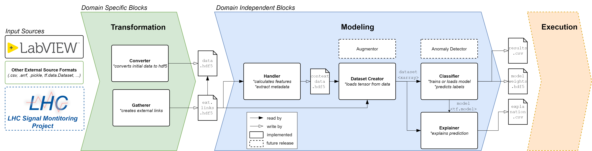

# Machine Learning Framework ( = mlframework)
## INTRODUCTION



This framework serves as a template for machine learning for failure prediction use cases.
It contains domain specific and domain independent building blocks.
Two example use cases are given for predicting breakdowns in CLIC RF cavities [1] and to classify heartbeats [2].

1) **Domain Specific: Transformation**:
   * Converter: transform source data into a more handy data format (eg. HDF5)
   * Gatherer: gather hdf files and creates external links for fast queries
2) **Domain Independent: Modeling**:
   * Handler: extracts features using tsfresh, creating context data file with features and meta data to select dataset efficiently
   * Dataset Creator: loads dataset for machine learning
   * Augmentor: augment data to improve results of classifier
   * Classifier: different models for supervised machine learning
   * Explainer: explain results of classifier
   * Anomaly Detector: different models for unsupervised machine learning
   
### System Requirements
The system requirements of the mlframework are:
- Linux OS (used on [Ubuntu](https://ubuntu.com/download/desktop), [CentOS 7](https://www.centos.org/)), or Windows
- [Python](https://www.python.org/) >= 3.8 <4
- [hdf5 tools](https://support.hdfgroup.org/HDF5/doc/RM/Tools/) >= 3 <4

we further recommend the use of:
- [pip](https://pip.pypa.io/en/stable/installation/), package management
- [virtualenv](https://virtualenv.pypa.io/en/latest/) to ensure package compatibility

To install the system requirements on debian based systems (e.g. Ubuntu) using the package manager `apt`, type the following into the command line:
```bash
apt update
sudo xargs apt install <system_requirements/requirements_deb.system
```
for rpm based systems (e.g. CentOS 7) using the system package manager `yum`, type the following into the command line:
```bash
yum update
sudo xargs yum install <system_requirements/requirements_rpm.system
```
***Further information about installation in the CERN environment:*** 
can be found in the detailed [Acc-Py](https://wikis.cern.ch/display/ACCPY/Getting+started+with+Acc-Py) guide.

### Installation
You get a copy of the whole mlframework repository by cloning it:
```bash
git clone https://gitlab.cern.ch/machine-protection-ml/mlframework.git  # Clone the gitlab project
cd mlframework  # step into folder
```
We recommend using a virtual environment to manage python packages. To initialize the virtual environment and source it
use:
```bash
virtualenv venv  # init the virtualenv
source venv/bin/activate  # source project
```
You can install the project via:
```bash
pip install -r requirements.txt
```
To use the virtual environment in jupyter notebooks, use:
```bash
pip install jupyter
ipython kernel install --user --name=venv
```

### Repository structure
```angular2html ( cleanpy .; tree -A -I "__init__.py|venv|__pycache__|log_files")
.
├── CI                          < files specific to continous integration
├── documentation               < documentation of projects and framework
│   └── model_plots             < plots of model structure
├── ECG200_main.py              < the main runfile for using ECG200 data
├── mypy.ini                    < configuration file for mypy
├── notebooks                   < notebooks to show basic principle of framework
│   ├── ECG200_modeling.ipynb   < notebook to show modeling of ECG200 dataset
│   ├── xbox2_feature_handling.ipynb < notebook to show feature handling of xbox data
│   ├── xbox2_modeling.ipynb    < notebook to show modeling handling of xbox data
│   └── xbox2_transformation.ipynb < notebook to show transformation handling of xbox data
├── README.md                   < explanation file
├── RELEASE.md                  < detailed description of first release and its merges
├── requirements.txt            < list of required python packages and version numbers  
├── setup.py                    < Setup file for using the project with "pip install mlframework"
├── sonar-project.properties    < properties for sonar code analyzation tool
├── src                         <<< source directory
│   ├── dataset_creator.py      < creates dataset
│   ├── datasets                < folder of data and files to create datasets
│   │   ├── ECG200              < ecg data
│   │   └── ECG200.py           < ecg python dataset creator file
│   ├── handler.py              < handles creation of context file from data
│   ├── htc                     < htc files for running code on HTCondor
│   │   ├── htc_runner.py       < Python script for running on gtc   
│   │   └── htc_sensitivity.sh  < shell script for running sensitivity analysis on htc
│   ├── model                   < model specification
│   │   ├── classifier.py       < creates Tensorflow model
│   │   ├── classifiers         < library of Tensorflow models
│   │   │   ├── layers          < custom Tensorflow layers
│   │   │   │   ├── cnn.py          < CNN layer
│   │   │   │   ├── cnn_dropout.py  < CNN Dropout layer
│   │   │   │   └── shortcut        < shortcut layer
│   │   │   ├── fcn.py          < FCN model
│   │   │   ├── fcn_2dropout.py < FCN with dropout model
│   │   │   ├── inception.py    < Inception model
│   │   │   ├── resnet.py       < Resnet model
│   │   │   └── time_cnn.py     < TimeCNN model
│   │   ├── default_hyperparameters.json < hyperparameter settings file
│   │   ├── explainer.py        < creates explainer for model explanation
│   │   └── sample_explainers   < here the sample explainers are found
│   │       ├── deep_shap.py     < DeepSHAP explainer
│   │       └── gradient_shap.py < GradientShap explainer
│   ├── output                  < output folder to store results, model weigths and explanations
│   ├── transformation.py       < tranforms data in special formats into a handy format (ex.: .tdms -> .hdf)
│   ├── utils                   < utilities of functions used in other classes
│   │   ├── hdf_tools.py            < tools to handle hdf files
│   │   ├── handler_tools           < combines data without copying it
│   │   ├── result_logging_tools.py < logging of results into csv 
│   │   └── transf_tools        < utilities used in the transformation
│   │       ├── convert.py      < converting tool
│   │       └── gather.py       < gather data scattered on multiple files
│   └── xbox2_specific          < files specific to the xbox2 experiment
│       ├── datasets            < dataset specification files for xbox2
│       ├── feature_definition  < feature definitions for xbox2
│       └── utils               < utilities for xbox2 dataset selection
├── system_requirements         < requirements depending on system
├── tests                       <<< tests for main code in the source directory
│   ├── integration             < tests from start to beginning (also called end to end test), NOT IMPLEMENTED YET
│   ├── unit                    < tests every function/class (also called atomic test)
│   └── utils                   < utilities for the testing suite (ex. creating test files)
└── xbox2_main.py               < the main runfile for using xbox2 data
```

### References
[1]  C. Obermair et al., “Machine Learning Models for Breakdown Prediction in RF Cavities for Accelerators,” in Proc. IPAC’21, 2021, no. 12, pp. 1068–1071, Available: https://jacow.org/ipac2021/papers/mopab344.pdf.
[2]  R. T. Olszewski, Generalized feature extraction for structural pattern recognition in time-series data. Carnegie Mellon University, 2001.